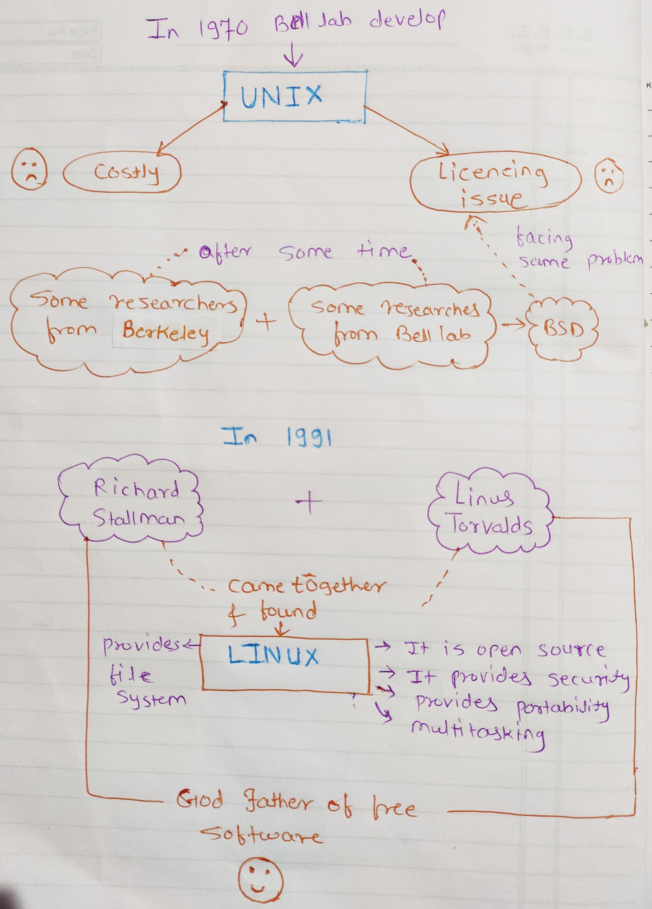

# Linux

## History of Linux 

In the 1970s the Bell lab company creates a system name Unix. they spend around one year creating this system. after that they started selling this to different companies and due to its increasing demand lots of companies and universities started using the Unix system. but the system had one drawback that it was very costly because of licensing. In the university of California the Berkeley also using Unix in their research but they face the same problem of licensing. They have to pay lots of money just to use it. So that some of the researchers from Berkeley and some ex-employees from Bellab started creating a new system by using a Unix base called BSD ( Berkeley Software Distribution).That was the first cheaper software but because of licensing nature of Unix, it was getting more costly. after that, In the 1980s there is a guy called Richard Stallman who wanted to develop his own open-source software so he started to create free software. Then he left his job to avoid a license problem. he started FSF (Free software foundation) In 1985 and he started creating his own OS called GNU and GNU has a kernel called HURD. In the1990s, a man named Linus Torvalds was doing research on math and physics. He intended to use the BSD and GNU systems, but neither of them appealed to him. Then he did some more research, spends some more time creating his own open-source software and after that, he creates his own kernel. a kernel is a software or code which interacts with the hardware. it is a low-level software and from 1991 he made it available completely for free. In 1991 Richard Stallman and  Linus Torvalds came together and found GNU Linux and It was a very successful project. lots of developers and researchers from university started to come up with the GNU project because it was completely free software and company have to pay zero amount for running a technology. That’s why Richard Stallman and Linus Torvalds are the godfathers of free software. we can use free software due to them.

------
#### Let's take closer look

## Linux Commands 
--------------------------

| Command Name            | Description
|------------------------ |-------------
| `ls command `           | ls command is used to list the file and folder of the current working directory. |
| `pwd command`       | Stands for print/present working directory. pwd command will tell you your current location.|
| `mkdir command`     | mkdir command is used to create a new directory. |
| `rmdir command`      |  rmdir command is used to remove the directory. It only removes the empty directory. |
| `rm command`          | rm command is used to remove a file or folder from the current directory. once you remove then it won’t be retrieved or recovered|
| `	rm -rf command`     |  rm -rf command used to delete an entire directory.  |
| `cd command`        | cd command is used for changing the current directory  |
| `cd - command`      | It will take you to the previous folder. it holds the last position |
| `cd~ /cd command`   | This command is used to go to the user’s home folder. |
| `	Cd .. command`    | This command takes you one step back.|
|`cp command`         | Stands for a copy. cp command is used to copy the file from one location to another.|
|`cp -rf command`    | This command is used for copying multiple folders. The last folder will be your destination folder.|
|`mv command`       | mv command is used to move a file from one location to another. it is also used to rename the file or folder. |
|`cat command`      | cat command is used to show the content of file on terminal.|
|`touch command`    | touch command is used to create a new file.|
|`who command`|who command is used to show how many users logged in to the system.|
|`whoami command`|whoami command is used to show the currently logged-in user.|
|`	history command`| history command is used to show how many commands you have been run.|
|`top command` |top command shows all system-level information and the current load of a system.|
|`ps command`| ps command is used to list all the applications running on the system.|
|`ping command `|ping command is used to check internet connectivity.|
|`ifconfig command`|ifconfig command is used to identify the IP address of the system.|
|`ssh command`|ssh command is used to access the remote server.
|`which command`| which command is used to show the location of software. 
|`wget command`| wget command is used to download files from a browser. It is a command-line browser.|
|`echo command` | echo command is used to show whatever you print. It will show the system path.|
|`clear command`| clear command is used to clean the screen. |
|`tail command `| tail command is used for continuous reading. It will display the last n lines of a file. tail -n <file_name>|
|	`more command`| more command is used to view the text files in the command prompt. more command gives us fewer data.| 
|`less command`| less command is similar to cat but only prints output page-wise. This command gives us more data. |
|`exit command`| exit command used to exit from terminal.|
|`ps -ef command`| This command is used to show running applications.|
|`help command`|help command is used to give more details of the command.|
|`man command `|It stands for manual. This is similar to the help command used to show more details of the command.|

----
## File system and Directory structure in Linux 
In Linux everything is considered as a file. Let’s see the more commands.

| Command Name    | Description                      |
|---------------- |-------------------------------   |
|`/boot `| Here the system kernel is stored.|
|`/bin` | Here all the binary files are stored.
|`/sbin `| It is a system binary just like a /bin . it is used for system admin.
|`/home`| here all the user's data and configuration are stored.
|`/var`| here variables are stored such as log files, temporary files, and other files.
|`/usr` |It is a user system resource. all the software is installed in user folder.
|`/root`|It has the permission of the entire system. here the main user is created. Root users donated by #  |
|`/temp `| Here all the temporary files are stored.|
|`/etc`| Here the system configuration is stored. It stands for etcetera.|
|`/lib`|Here system libraries are stored.|
|`/dev`|It is a memory file. here external devices are getting mounted such as a keyboard, mouse.|
|`/mnt`| stands for the mount. It is used to mount the file system found on a device like a cd rom and DVD drives.|
|`/opt`| Here user-related software is stored.|
|`/proc`| It will give us all system-level information.|

-------

